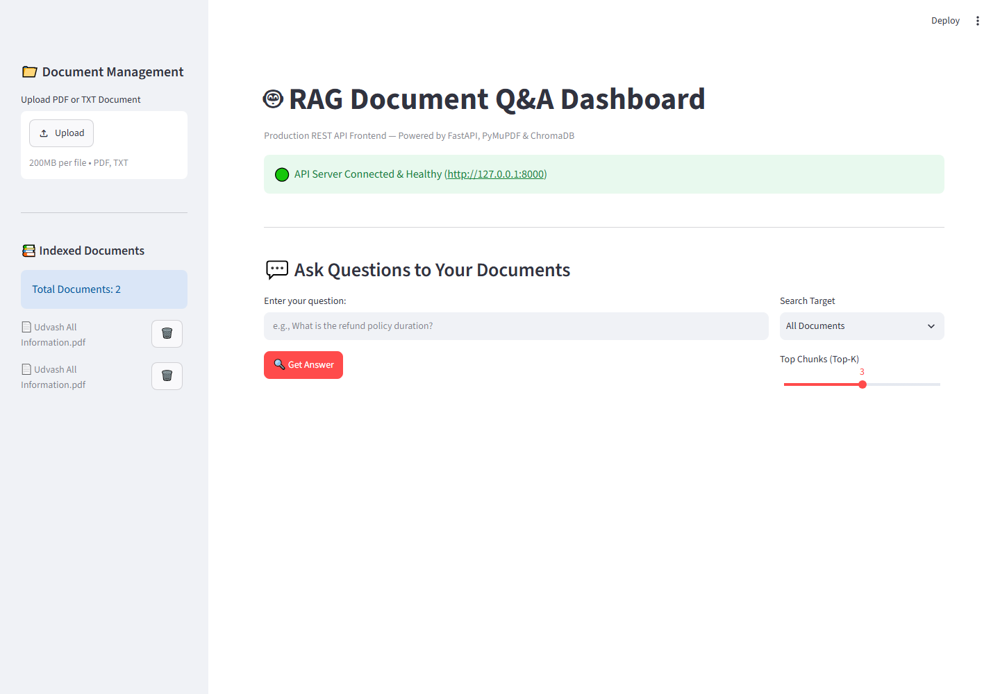
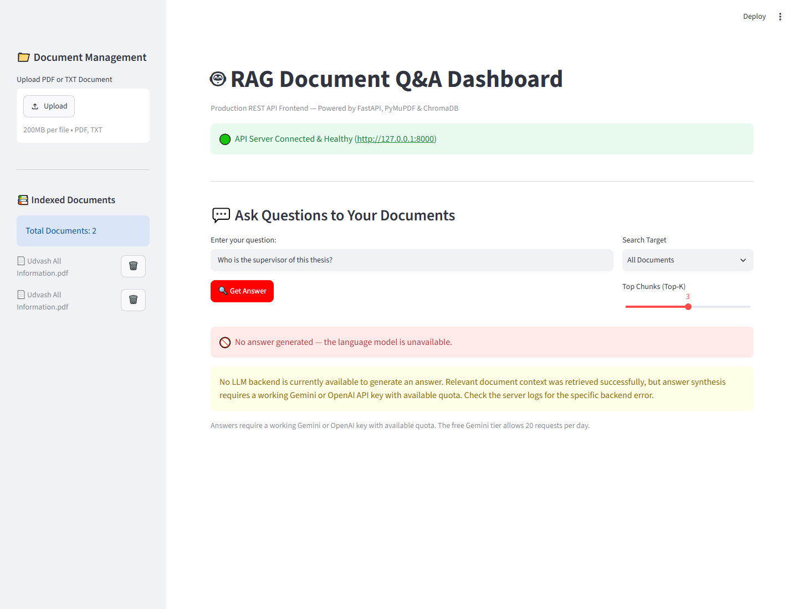

# 🤖 RAG Document Q&A Dashboard & API


A production-grade Retrieval-Augmented Generation (RAG) system built with **FastAPI** for the backend and **Streamlit** for the frontend dashboard. This application allows users to upload PDF or TXT documents, indexes them using local vector embeddings, and enables context-aware Q&A using Google's **Gemini** model (with OpenAI fallback).

It supports **multilingual embeddings** (including English and Bengali) to provide accurate semantic search across different languages.

**Key principle:** The system never returns an unsynthesized answer. If no LLM backend can generate a grounded response, the API returns HTTP 503 with an actionable error message rather than degrading to regex extraction or raw chunk dumps.

---

## ✨ Features

- **Document Ingestion**: Upload `.pdf` and `.txt` files easily.
- **Smart Chunking**: Text is automatically extracted (via PyMuPDF) and chunked with overlaps to maintain context.
- **Multilingual Vector Search**: Uses Hugging Face's `sentence-transformers/paraphrase-multilingual-MiniLM-L12-v2` and stores vectors locally in **ChromaDB**.
- **Generative Q&A**: Uses `gemini-2.5-flash` to synthesize grounded, natural language answers based *only* on the retrieved context.
- **No Silent Degradation**: Answer synthesis is Gemini → OpenAI and nothing else. If every backend fails, `/query` returns **503** instead of a fabricated or extraction-based answer, so quota exhaustion is never mistaken for a real answer.
- **Citations & Sources**: Every generated answer provides the exact source chunks and page numbers used to formulate the response.
- **RESTful API**: Fully structured API using FastAPI, Pydantic validations, and Swagger UI.
- **Interactive UI**: A sleek Streamlit dashboard for document management and chatting.

---

## 🏗️ Architecture

1. **Frontend (Streamlit)**: User interface for uploading documents, selecting active documents, and submitting queries.
2. **Backend (FastAPI)**: Handles document processing, embedding generation, vector storage, and language model inference.
3. **Vector Store (ChromaDB)**: Persistently stores document embeddings locally (`data/chroma_db`).
4. **LLM (Gemini)**: Processes the augmented prompt and returns the final answer.

---

## 📸 Screenshots




---

## 🚀 Getting Started

### Prerequisites

- Python 3.9+
- A Google Gemini API Key

### Installation

1. **Clone the repository:**
   ```bash
   git clone https://github.com/yourusername/repo-name.git
   cd repo-name
   ```

2. **Create a virtual environment:**
   ```bash
   python -m venv .venv
   source .venv/bin/activate  # On Windows use: .venv\Scripts\activate
   ```

3. **Install dependencies:**
   ```bash
   pip install -r requirements.txt
   ```

4. **Environment Variables:**
   Create a `.env` file in the root directory and add your API key:
   ```env
   GEMINI_API_KEY=your_google_gemini_api_key_here
   ```

---

## 💻 Running the Application

This project requires running both the FastAPI backend and the Streamlit frontend.

### 1. Start the FastAPI Backend
```bash
python -m app.main
```
The API will start at `http://127.0.0.1:8000`.
- **Swagger Docs:** `http://127.0.0.1:8000/docs`

### 2. Start the Streamlit Dashboard
Open a new terminal window, activate the virtual environment, and run:
```bash
streamlit run streamlit_app.py
```
The dashboard will open automatically in your browser at `http://localhost:8501`.

---

## 📡 API Endpoints

- `GET /health` - Check API server health.
- `POST /upload` - Upload and index a `.pdf` or `.txt` document.
- `GET /documents` - List all indexed documents.
- `DELETE /documents/{doc_id}` - Delete a document and its embeddings from the vector store.
- `POST /query` - Ask a question against a specific document (or all documents).

### Response codes for `/query`

| Code | Meaning |
|------|---------|
| `200` | Answer synthesized successfully, with source citations. |
| `200` | Retrieval found no matching chunks — returns a "no relevant information" message. This is a statement about the index, not a synthesized answer, so it needs no LLM. |
| `503` | Retrieval succeeded but no LLM backend was available (missing key, exhausted quota, or API error). **No answer is returned.** Retry once quota or the key recovers. |

---

## ✅ Accuracy Testing

`test_pdf_accuracy.py` scores the pipeline against ground truth extracted from the source PDFs. A question passes only if **every** expected substring appears in the answer, so a fluent-but-wrong answer cannot pass. Questions are scoped by `doc_id` so one document's chunks cannot answer another's questions.

```bash
python test_pdf_accuracy.py    # writes pdf_accuracy_results.txt
```

### Latest results — `main (4).pdf` (thesis title page): **9/9**

| Test | Result |
|------|--------|
| Multi-line title reassembly | ✅ Correct across the PDF line break |
| Author, roll number | ✅ Exact match |
| Supervisor vs. external examiner | ✅ Kept distinct despite near-identical adjacent blocks |
| Degree, institution, submission date | ✅ Correct |
| **CGPA (absent from document)** | ✅ **Refused** — *"not mentioned in the provided document context"* |

The hallucination check matters most: asked for a value the document does not contain, the system declines rather than inventing one.

> **Note:** This PDF ingests as a single 716-character chunk, so retrieval is trivially complete — these results measure *synthesis* quality, not retrieval.

### Not yet run — `Udvash All Information.pdf` (14 pages, 16 chunks)

A 16-question set covering the harder retrieval cases (own vs. father's mobile number, home district vs. present area, a Bengali-language question) is written and ready in `test_pdf_accuracy.py`, but **has not been run**. The full 25-question suite exceeds the Gemini free-tier cap of 20 requests/day. Set `RUN_UDVASH = True` with a paid key or a spare day's quota to include it.

---

## 🛠️ Configuration
You can tweak system settings inside `app/config.py`:
- `CHUNK_SIZE`: Default is 800 tokens.
- `CHUNK_OVERLAP`: Default is 100 tokens.
- `DEFAULT_TOP_K`: Number of chunks to retrieve for context (Default: 8).

### API quota

The free Gemini tier allows **20 requests/day** and **5 requests/minute** for `gemini-2.5-flash`. Both limits surface as HTTP 503 from `/query`. Since there is no offline fallback by design, a working key with available quota is required for any answer. `check_gemini.py` verifies the key is loaded and the API reachable:

```bash
python check_gemini.py
```

---

## 📜 License
This project is licensed under the MIT License.
